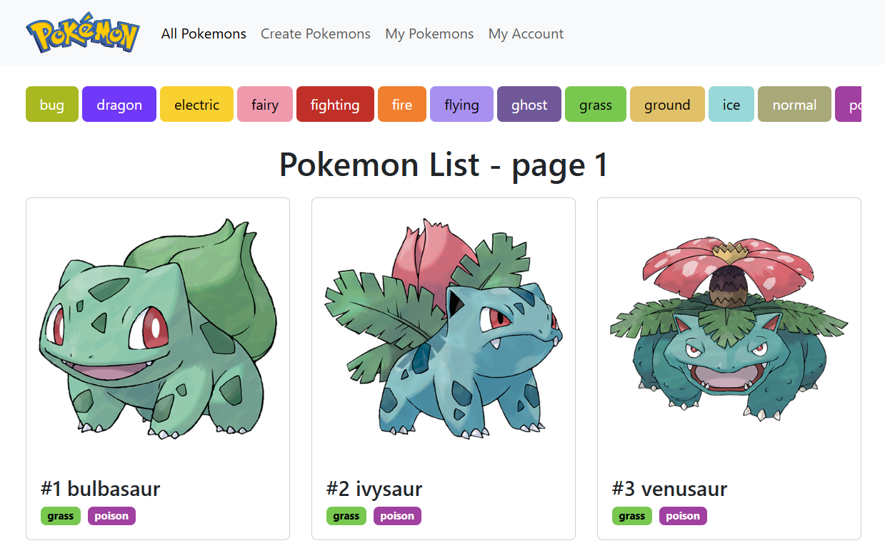

# PokemonProject
- Web with Pokemon List, Detail, Comment, Admin and forms to add new Pokemon and Comment
- Using Python, Django, Bootstrap, Django AllAuth
- Data, Images included and responsive design



## ⚙️ Instalation instructions
Clone repository:
```
git clone https://github.com/itstep-praha/PokemonProject
```

Change dir:
```
cd PokemonProject
```

Create venv:
```
python -m venv .venv
```

Activate venv on Windows:
```
.venv\Scripts\activate
```
Activate venv on macOS or Linux:
```
source .venv/bin/activate
```

Install requrements:
```
pip install -r requirements.txt
```

Run server:
```
python manage.py runserver
```

## 🛢️ Load data
Requires to create django superuser using (follow instructions):
```
python manage.py createsuperuser
```

Run load data script
```
python manage.py shell

>>> from pokemon.data.load_data import main
>>> main()
```

## Pokemon Data & Image Source
1. https://pokeapi.co/
2. https://github.com/PokeAPI/pokeapi
